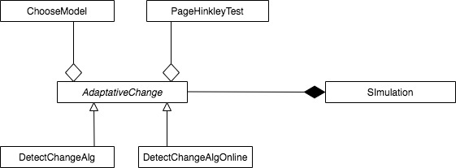

# Algoritmo Adaptativo ('Concept Drift')

Librería que incluye dos versiones de un algoritmo adaptativo y reactivo ante el fenómeno conocido como 'Concept Drif') .

Utiliza un detector de cambios ( Page-Hinkley Test ), tamaño de ventana de datos variable, técnica de olvido de datos abrupta, y automatización de búsqueda del modelo más preciso.

Los 4 módulos de esta librería son:
* **PageHinkleyTest:**  *Detector de cambios.* 
* **ChooseModel:**  *Búsqueda de modelo.*  
* **AdaptativeChange:**  *Incluye dos diferentes algoritmos, versión estándar y versión oline, hacen uso de los dos anteriores módulos, y se encarga del procesamiento de datos.* 
* **Simulation:**  *Incluye casos de prueba para validar los diferentes algoritmos.*  
<p>&nbsp;</p>
<p>&nbsp;</p>


<p>&nbsp;</p>
<p>&nbsp;</p>
## Instrucciones 

### Pre-requisitos 📋

Para utilizar esta librerías es necesario disponer de Python instalado en tu equipo. 
* [Python](https://www.python.org/downloads/)

Una vez disponemos de Python, descargar el repositorio desde GitHub o usando desde la consola el comando:

```
git clone https://github.com/ogomezr/concept-drift-library.git
```


### Instalación 🔧

#### Paso 1
Acceso a la carpeta del repositorio.
```
cd concept-drift-library
```
#### Paso 2 ( Opcional ) 
Uso de entorno virtual para la instalación del proyecto y librerías necesarias

Creación entorno virtual desde la línea de comandos:
```
python -m venv conceptdrift
```
Activación entorno virtual (Linux/Mac):

```
source ./conceptdrift/bin/activate
```
Activación entorno virtual (Win):

```
./conceptdrift/Scripts/activate
```

#### Paso 3
Instalación del proyecto:
```
pip install -e .
```

#### Paso 4
Librerías necesarias para la ejecución de las simulaciones.
Si ya dispones de estas librerías en tu entorno Python no necesitarás instalarlas.
* Numpy
```
pip install numpy
```
* Statsmodels
```
pip install statsmodels
```
* Scikit-learn
```
pip install sklearn
```
* Matplotlib
```
pip install matplotlib
```

* Pandas
```
pip install pandas
```

* Seaborn
```
pip install seaborn
```

## Ejecución de las simulaciones ⚙️

Para ejecutar las diferentes simulaciones accedemos a la carpeta cases dentro del repositorio:
```
cd conceptdrift/cases
```
Ejecutamos los diferentes casos, por ejemplo case1.py desde la consola con el comando:

```
python case1.py
```
Obtendremos los resultados y gráficos del caso 1.
## Autor ✒️


* *Óscar Gómez* - [ogomezr](https://github.com/ogomezr)
 


## Licencia 📄

Este proyecto está bajo la Licencia MIT - más detalles en el archivo LICENSE.
